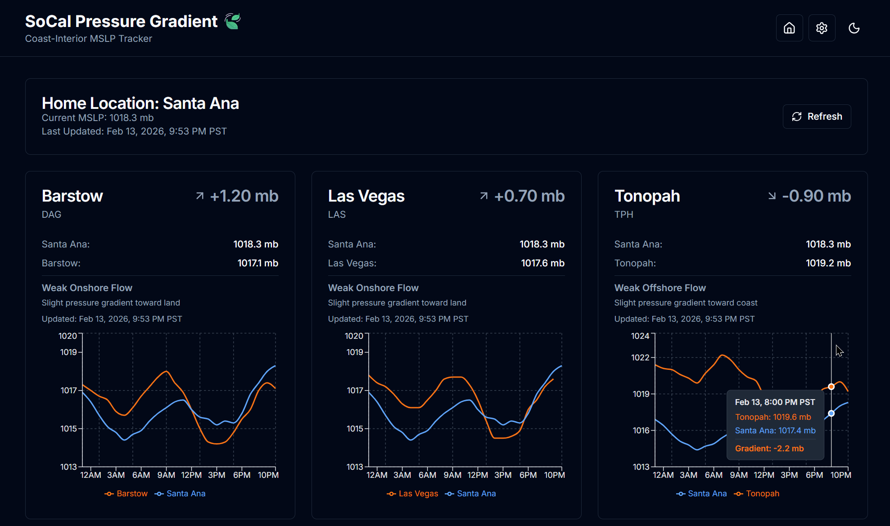

# SoCal Coast-Interior Pressure Gradient Tracker 🍃

A Next.js web application that tracks and displays Mean Sea Level Pressure (MSLP) differences between coastal and interior Southern California locations. This tool helps visualize pressure gradients that indicate offshore vs. onshore wind patterns.

## Screenshots


*Dashboard showing real-time pressure gradients with interactive 24-hour trend charts for comparison locations*

## Features

- 🌡️ **Real-time MSLP Data**: Fetches current pressure data from NOAA METAR airport observations
- 📊 **Pressure Gradient Visualization**: Displays pressure differences between home location and up to 3 comparison locations
- 📈 **24-Hour Pressure Trend Graphs**: Interactive line charts showing pressure trends over the past 24 hours for each location
- 📐 **Gradient on Hover**: Chart tooltips display the computed pressure gradient (home − compare) with color coding for onshore/offshore flow
- ⚠️ **Limited Data Warnings**: Per-station warnings when a location has fewer than 6 hourly data points (e.g., history still building)
- 🎨 **Modern UI**: Clean, responsive design with light/dark theme support
- 📍 **25 Verified METAR Stations**: All locations are verified airport METAR reporting stations with ICAO codes
- ⚙️ **Location Management**: Add, edit, and delete locations (max 25)
- 🏠 **Set Home Location**: Choose any location as your home base from the Settings UI
- 👁️ **Dashboard Customization**: Select up to 3 locations to display on the dashboard
- 🔄 **Manual Refresh**: On-demand refresh button to fetch the latest pressure data
- 🔁 **Auto-Refresh Dashboard**: Dashboard automatically refreshes every 5 minutes in the browser
- ⚙️ **Configurable API Refresh**: Set API data refresh interval from 1 to 60 minutes
- 🕐 **Timezone-Aware Timestamps**: All timestamps automatically converted to your local timezone
- 💾 **Persistent Storage**: JSON-based data storage for location configurations and 24-hour pressure history
- 📦 **24-Hour Pressure History**: Persistent accumulation of hourly MSLP readings for all 25 stations, surviving server restarts
- 🔄 **Instant 24-Hour Seeding**: NOAA API `start` parameter requests a full 24-hour observation window on every load, so charts are fully populated even on first run
- ⏱️ **Smart Data Updates**: Data cached with configurable revalidation (default 5 minutes), shows current hour readings
- 🛡️ **Resilient Data Fetching**: Individual station failures don't break the entire dashboard — failed stations are reported gracefully

## Technology Stack

- **Framework**: Next.js 16.0.7 (Turbopack, App Router)
- **Language**: TypeScript
- **Styling**: Tailwind CSS
- **UI Components**: shadcn/ui (Radix UI primitives)
- **Charts**: Recharts (responsive charting library)
- **Data Source**: NOAA Weather API (METAR observations, no API key required)
- **Icons**: Lucide React
- **Theme**: next-themes (light/dark mode)

## Getting Started

### Prerequisites

- Node.js 18+
- npm or yarn

### Installation

1. Clone the repository:
```
git clone <https://github.com/djtrustgod/SoCal-Coast-Interior-Pressure-Gradient-Tracker.git>
cd SoCal-Coast-Interior-Pressure-Gradient-Tracker
```

2. Install dependencies:
```
npm install
```

3. Run the development server:
```
npm run dev
```

4. Open [http://localhost:3000](http://localhost:3000) in your browser

### Windows GUI Launcher (Optional)

For one-click start/stop without a terminal, a small WinForms launcher lives under `tools/`:

- **Launch directly**: double-click `tools/server-gui.bat` — opens a window with Start / Stop / Open-in-Browser buttons, Dev/Prod toggle, and a live log pane.
- **Pin to taskbar**: run `powershell -ExecutionPolicy Bypass -File tools/create-shortcut.ps1` to create a Desktop shortcut, then right-click the shortcut → *Show more options* → *Pin to taskbar*. The shortcut uses the app's leaf icon.
- **Regenerate the icon** (`public/favicon.ico`): `node tools/make-icon.js` — rasterizes `tools/icon-source.svg` (Twemoji 🍃, CC-BY 4.0) at 16/32/48/64/128/256 into a multi-size `.ico`.

The launcher writes the server's stdout/stderr to `%TEMP%\socal-pressure-server.log` (not through a PowerShell pipe), so the server never blocks if the GUI window is closed. If the GUI ever crashes, check `%TEMP%\socal-pressure-gui-crash.log`.

If you close the launcher while the server is still running and reopen it later, the new launcher window detects the existing process on port 3000, attaches to it, and lights up the Stop button so you can shut it down from the GUI. Closing the launcher window will not stop a server it didn't start.

## Usage

### Dashboard

The main dashboard displays:

- Current MSLP for the home location (customizable)
- Pressure gradients for up to 3 comparison locations (customizable)
- **Pressure trend graphs** for each comparison location showing historical METAR observations
- Color-coded interpretations (offshore flow, onshore flow, neutral)
- Last update timestamps in your local timezone (e.g., "Dec 6, 2025, 8:00 PM PST")
- Manual refresh button to fetch the latest data on-demand
- Automatic browser refresh every 5 minutes to keep data current
- Configurable API data caching (1-60 minutes)
- Pressure values displayed in millibars (mb)

### Interpreting Gradients

- **Positive values (blue)**: Higher pressure at coast (home) → Onshore flow (typical marine layer conditions)
- **Negative values (red/orange)**: Higher pressure inland (compare) → Offshore flow (Santa Ana wind potential)
- **Near zero (gray)**: Neutral conditions, minimal pressure gradient

### Location Management

Navigate to the Settings (gear icon) to:

- View all configured locations (coastal vs. interior)
- **Set Home Location**: Click the home icon next to any location to set it as your home base
- **Select Dashboard Locations**: Click the eye icon to add/remove locations from dashboard display (max 3)
- **Configure API Refresh Interval**: Set how often data is fetched from NOAA Weather API (1, 5, 10, 15, 30, or 60 minutes)
- Add new locations (up to 25 total)
- Edit existing locations (name, code, coordinates, type, elevation)
- Delete locations (locations in use as home cannot be deleted)
- See location details with visual badges (HOME, DASHBOARD)
- Location counter shows current usage (e.g., "24 of 25 locations configured")

## Project Structure

```
├── app/
│   ├── layout.tsx           # Root layout with theme provider
│   ├── page.tsx             # Main dashboard (server component)
│   ├── locations/
│   │   └── page.tsx         # Location management page
│   └── api/
│       ├── pressure/        # Pressure data API endpoint
│       └── locations/       # Location CRUD API endpoint (GET/POST/PATCH/PUT/DELETE)
├── components/
│   ├── ui/                  # shadcn/ui components (Button, Card, Dialog, Select)
│   ├── dashboard-content.tsx # Client component with refresh functionality
│   ├── gradient-card.tsx    # Pressure gradient display card with timestamps and charts
│   ├── pressure-trend-chart.tsx # 24-hour pressure trend chart with theme support
│   ├── edit-location-dialog.tsx # Dialog for editing location details
│   ├── header.tsx           # App header with navigation
│   ├── location-selector.tsx # Location comparison selector (unused)
│   ├── theme-provider.tsx   # Theme context provider
│   └── theme-toggle.tsx     # Light/dark mode toggle
├── lib/
│   ├── api/
│   │   └── metar.ts         # NOAA METAR API client
│   ├── calculations/
│   │   └── gradient.ts      # Pressure gradient calculations
│   ├── data/
│   │   ├── locations.ts     # Shared file reader utilities for locations.json
│   │   └── pressure-history.ts # 24-hour pressure history persistence (read/write/merge/prune)
│   └── utils.ts             # Utility functions
├── data/
│   ├── locations.json       # Location configurations
│   └── pressure-history.json # Persistent 24-hour pressure readings for all stations
├── types/
│   └── location.ts          # TypeScript type definitions
└── public/                  # Static assets
```

## API Endpoints

### GET /api/pressure

Fetch MSLP data for specified locations.

**Query Parameters:**

- `ids`: Comma-separated location IDs

**Example:**
```
GET /api/pressure?ids=sna,sba,dag
```

### GET /api/locations

Get all configured locations, home location ID, and dashboard location IDs.

**Response:**
```json
{
  "homeLocationId": "sna",
  "dashboardLocationIds": ["sba", "smx", "dag"],
  "locations": [...]
}
```

### POST /api/locations

Add a new location.

**Body:**
```json
{
  "id": "location-id",
  "name": "Location Name",
  "code": "CODE",
  "latitude": 34.0,
  "longitude": -118.0,
  "type": "coast" | "interior",
  "elevation": 100
}
```

### PATCH /api/locations

Update home location, dashboard location selections, or API refresh interval.

**Body (Set Home):**
```json
{
  "homeLocationId": "sba"
}
```

**Body (Set Dashboard Locations):**
```json
{
  "dashboardLocationIds": ["sba", "smx", "dag"]
}
```

**Body (Set API Refresh Interval):**
```json
{
  "apiRefreshInterval": 300
}
```
*Note: Value in seconds, minimum 60, maximum 3600*

### PUT /api/locations

Update an existing location's details.

**Body:**
```json
{
  "id": "location-id",
  "name": "Updated Name",
  "code": "CODE",
  "latitude": 34.0,
  "longitude": -118.0,
  "type": "coast",
  "elevation": 100
}
```

### DELETE /api/locations?id=location-id

Delete a location (cannot delete home location or locations in dashboard).

## Configuration

### Changing the Home Location

**Via UI (Recommended):**

1. Navigate to Settings (gear icon)
2. Find the location you want to set as home
3. Click the home icon next to that location
4. Confirm in the dialog

**Manual Edit:**
Edit `data/locations.json`:
```json
{
  "homeLocationId": "sna",  // Change to any location ID
  "dashboardLocationIds": ["sba", "smx", "dag"],  // Up to 3 location IDs
  "locations": [...]
}
```

### Adding Custom Locations

Either use the UI or manually edit `data/locations.json`:
```json
{
  "id": "custom-id",
  "name": "Custom Location",
  "code": "CUS",
  "latitude": 34.0,
  "longitude": -118.0,
  "type": "coast",
  "elevation": 50
}
```

## Data Caching

- **Pressure data**: Revalidated every 1 hour
- **Location config**: Read from file system (instant updates)

## Building for Production

### Standard Build

```bash
npm run build
npm run start
```

The Next.js app runs on `http://localhost:3000` by default.

### Docker Deployment

The application can be deployed using Docker for easy containerized deployment.

#### Prerequisites

- Docker Desktop installed
- Docker Compose (recommended)

### Quick Start with Docker Compose

#### Build and start the container

docker-compose up -d

#### View logs

docker-compose logs -f

#### Stop the container

docker-compose down

The app will be available at `http://localhost:3000`.

### Using Docker Directly

#### Build the image

docker build -t socal-pressure-tracker .

#### Run the container with data persistence

docker run -d \\
  --name socal-pressure-tracker \\
  -p 3000:3000 \\
  -v $(pwd)/data:/app/data \\
  socal-pressure-tracker

#### View logs

docker logs -f socal-pressure-tracker

#### Stop and remove

docker stop socal-pressure-tracker
docker rm socal-pressure-tracker

### Upgrading from Previous Docker Versions

If you have an existing Docker deployment and want to upgrade to the latest version:

#### Using Docker Compose (Recommended)

docker-compose down                    # Stop the current container
docker-compose build --no-cache        # Rebuild with latest code
docker-compose up -d                   # Start with new image

#### Using Docker Directly

docker stop socal-pressure-tracker     # Stop the container
docker rm socal-pressure-tracker       # Remove the container
docker rmi socal-pressure-tracker      # Remove old image
docker build -t socal-pressure-tracker . # Rebuild image
docker run -d \\
  --name socal-pressure-tracker \\
  -p 3000:3000 \\
  -v $(pwd)/data:/app/data \\
  socal-pressure-tracker

#### Verify the upgrade

docker ps                               # Check container is running
docker logs socal-pressure-tracker     # View startup logs

⚠️ **Important**: Your data in the `./data` directory will be preserved during the upgrade as long as you use the same volume mount.

#### Important Notes

⚠️ **Data Persistence**: The `-v ./data:/app/data` volume mount is **critical** for persisting location configuration changes. Without it, any changes made through the UI will be lost when the container restarts.

**Port Configuration**: To use a different port, change the mapping: `-p 8080:3000` maps host port 8080 to container port 3000.

**Network Requirements**: The container needs outbound internet access to reach the NOAA Weather API.

## Contributing

Contributions are welcome! Please feel free to submit a Pull Request.

## License

This project is released under the CC0 1.0 Universal (Public Domain) license. See LICENSE file for details.

## Acknowledgments

- Weather data provided by [NOAA Weather API](https://www.weather.gov/documentation/services-web-api) (METAR observations)
- UI components from [shadcn/ui](https://ui.shadcn.com/)
- Built with [Next.js](https://nextjs.org/)

## Support

For issues or questions, please open an issue on GitHub.
